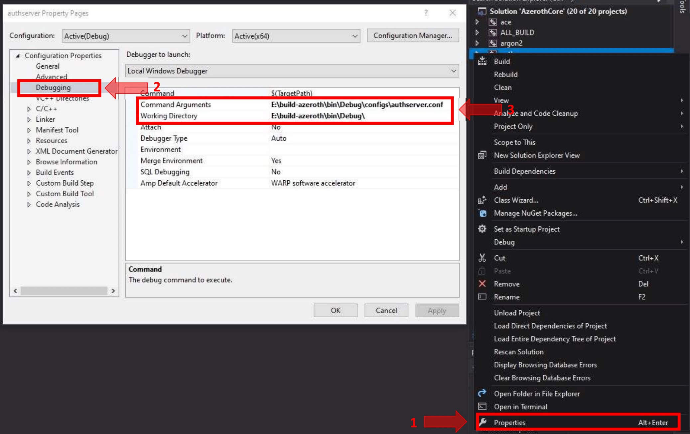

# Run Worldserver and Authserver in Visual Studio

Running the Worldserver and Authserver through Visual Studio has some benefits.

1. You can easily debug code using breakpoints or easily finding the Call Stack of a crash.

    1. It will also let your server pause instead of crashing when you hit a crash, and you can easily just continue after your debugging. 

1. If you are working on the code, this can save you time when you need to go in-game to test as you wouldn't need to open your binaries folder and start them induvidually.

## Configuring Visual Studio

1. Choose the desired build configuration, in this guide we will refer to Debug.

1. Right-click **Solution 'AzerothCore' (20 of 20 projects)**.

    1. Select **Properties**.

    1. Select **Multiple Startup Projects**.

        1. In the dropdown menu, select **Start** for **authserver** and **worldserver**.

    

1. Right-click **authserver**.

    1. Select **Properties**.

    1. Select **Debugging**.

        1. In **Command Arguments** choose your path to the .conf file for your Debug build.

        1. In **Working Directory** choose your path to the directory of your binaries.

    

1. Do step 3. for **worldserver** as well.

1. Starting the Worldserver and Authserver.

    1. Press the **Start** button or **F5** to launch Worldserver and Authserver within Visual Studio. (This is good for debugging)

    1. Press **Ctrl + F5** to start Worldserver and Authserver outside of Visual Studio
