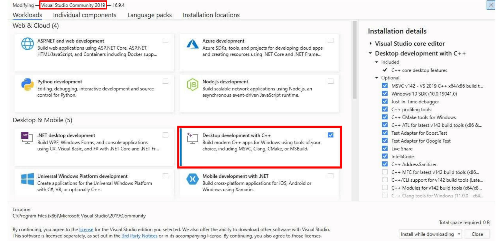
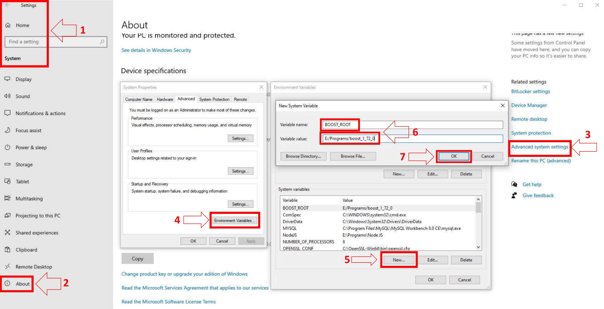

---
prev:
  text: 'Start: Installation Guide'
  link: 'classic-installation'

next:
  text: 'Step 2: Core Installation'
  link: 'windows-core-installation'
---

# Windows Requirements

```
- Windows ≥ 10
- Boost ≥ 1.78
- MySQL ≥ 8.0 (Recommended 8.4)
- OpenSSL ≥ 3.x.x
- CMake ≥ 3.27
- MS Visual Studio (Community) ≥ 17 (2022) (Desktop) (No preview)
```

1. [Git](https://git-scm.com/download/win)
    1. Download the standalone installer
        - During Git installation - Adjust your PATH environment. Pick "Git from the command line and also from 3rd-party software".

2. [Github Desktop](https://desktop.github.com/)
    1. Download the installer and follow the steps to set it up.

3. Install the compiler / IDE [Visual Studio Community 2022 (ver 17)](https://visualstudio.microsoft.com/downloads/)
    - You will need to install the C++ compiler.
    - To do this, select **Desktop development for C++** under **Workloads -> Desktop & Mobile**.



4. [MySQL Server Community Edition](https://dev.mysql.com/downloads/mysql/8.4.html)
    1. Download the Windows MSI Installer.
    2. Scroll down to the bottom and click on "No thanks, just take me to the downloads!"
    3. When the installation is almost done, make sure "Launch the MySQL Instance Configuration Wizard" is checked, then click "Finish".
    4. When the MySQL Instance Configuration Wizard launches, most default options are fine, but remember the username and password you use (root // whatever). You will need them to log into your chosen database management tool (below) in order to import SQL files later.
    5. To test if MySQL is set up correctly, hit CTRL+ALT+DEL on your keyboard, enter the Task Manager, and select the "Services" tab. In the list of services you should see "MySQL" with a status of "Running".
    6. Add MySQL to Environment Variables.
        1. Go to Control Panel -> System
        2. Go to Advanced System Settings
        3. Go to Environment Variables
        4. Under "Systemvariables" select **Path**
        5. Edit and add your install path of MySQL, i.e **C:\Program Files\MySQL\MySQL Server 8.0\bin\\**

::: info Note
Make sure to find the MySQL development files; you'll need them later. These files are shipped with MySQL Server, search for them in the program files directory, MySQL\MySQL Server 8.0\lib / MySQL\MySQL Server 8.4\lib.
:::

5. Choose a database management tool
    - MySQL cli (Fastest)
    - [SQLYog Community Edition](https://github.com/webyog/sqlyog-community/wiki/Downloads)
    - [HeidiSQL](https://www.heidisql.com/download.php) (Best for beginners)
    - [DBeaver](https://dbeaver.io/) (Multiplatform Database Management Tool)

    1. Try connecting to your database. You may be looking for "Connect to Host", "New Connection" or "Session Manager" depending on which program you use.
    2. Create a new connection/session. The Hostname/IP address of "127.0.0.1" or "localhost" is fine if you installed MySQL on the same computer that you installed HeidiSQL or SQLYog. Simply fill in your root // whatever password and you should now be able to connect to your database.

6. [CMake](https://cmake.org/download/)
    1. Download and install the **Latest Release** windows-x86_64.msi file, **NEVER the RC (Release Candidate) versions.**
    2. We recommend compiling in 64-bit mode.

7. [OpenSSL](http://www.slproweb.com/products/Win32OpenSSL.html) Download the 64bit version.
    1. Find the 64-bit version by finding the latest 3.x.x Win64 OpenSSL that is NOT the "light" version. (Example: Win64 OpenSSL v3.0.7)
        - If you get the error 'Missing Microsoft Visual C++ .... Redistributable' while installing OpenSSL, download the [Microsoft Visual C++ 2017/2019/2022 Redistributable Package (x64) (Direct Download)](https://aka.ms/vs/17/release/vc_redist.x64.exe) (1.7MB Installer) and install it.
        - While installing OpenSSL, choose The OpenSSL binaries (/bin) directory (NOT "The Windows system directory") when given the choice of where to copy the OpenSSL DLLs. These DLLs will need to be located easily for [Core Installation](windows-core-installation).

8. [Boost](https://www.boost.org/).
    1. Download the prebuilt Windows Binary for Visual Studio 2022. [64bit](https://sourceforge.net/projects/boost/files/boost-binaries/1.81.0/boost_1_81_0-msvc-14.3-64.exe/download)
    2. Add an environment variable to the "System" variable named "BOOST_ROOT" and with the value being your Boost installation directory, e.g. `C:/local/boost_1_81_0`. Important is to use '**/**', not '**\\**'  when pointing to the directory. (Make sure that it does not have a trailing slash (end of the path). If you still get problems, add the same variable in the `USER` variables section too, as shown in the image below.)



::: info Note
Notice that this image shows the version number 1.72.0 - use your actual version number in your settings.
:::

<!--@include: ./help.md-->
